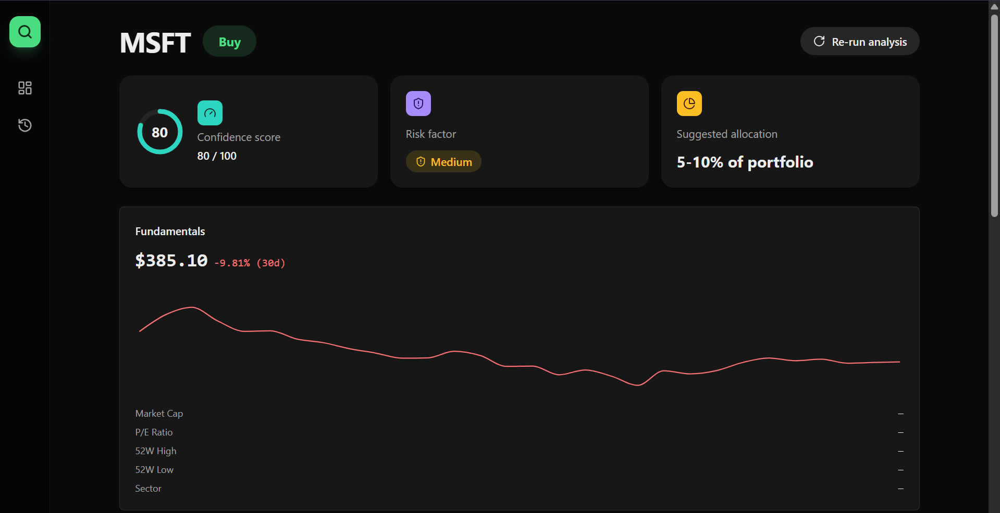
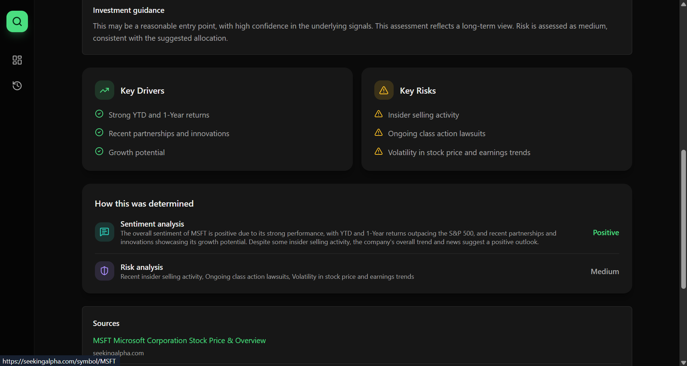
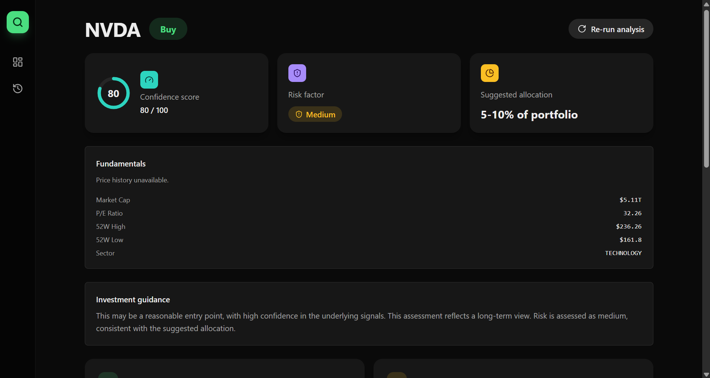
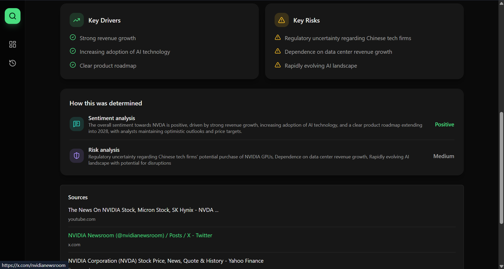

# Thesis — AI Investment Research Agent

**🔗 Live demo:** http://3.6.95.116:5173 — deployed via Docker on AWS EC2 (see [Deployment](#deployment) below)

An AI agent that takes a company name (or ticker), researches it in real time, and produces a full investment verdict — not just a yes/no, but a spectrum: verdict tier, confidence score, risk factor, suggested allocation, time horizon, key drivers, key risks, and a transparent breakdown of how it got there.

Built for the InsideIIM × AltUni AI Labs AI Product Development Engineer (Intern) take-home assignment.

---

## 1. Overview

Most "should I invest?" tools give a binary yes/no. Thesis instead treats the decision as a **spectrum**:

- **Verdict tier** — Strong Buy / Buy / Hold / Caution / Avoid (5-point, not 2)
- **Confidence score** — 0–100, reflecting how strong and consistent the underlying signals were
- **Risk factor** — Low / Medium / High / Volatile
- **Suggested allocation band** — e.g. "5–10% of portfolio" (a suggestion, not a dollar figure — see disclaimers below)
- **Time horizon** — Short-term or Long-term
- **Key drivers / Key risks** — the specific factors behind the verdict, in plain language
- **Explainability trace** — the underlying sentiment analysis and risk analysis summaries that fed into the final verdict
- **Sources** — the actual news articles the agent read, with clickable links

The app is a full-stack product: authenticated users can run research on any company, see results rendered on a dedicated report page, and revisit a persistent history of past research from their dashboard.

**Disclaimer shown in-app:** all output is AI-generated analysis for informational purposes only, not financial advice.

---

## 2. How to run it

### Prerequisites
- Node.js 20+
- A PostgreSQL database (we used [Neon](https://neon.tech), free tier)
- API keys for: Groq, Tavily, Alpha Vantage (all have free tiers)

### Environment variables

**`backend/.env`**
```
DATABASE_URL=postgresql://...          # your Neon (or any Postgres) connection string
JWT_SECRET=some_long_random_string
GROQ_API_KEY=...
TAVILY_API_KEY=...
ALPHA_VANTAGE_API_KEY=...
PORT=5000
```

**`frontend/.env`** (or set at build time)
```
VITE_API_URL=http://localhost:5000/api
```

### Setup

```bash
# Backend
cd backend
npm install
npx prisma migrate dev
npm run dev          # runs on http://localhost:5000

# Frontend (separate terminal)
cd frontend
npm install
npm run dev           # runs on http://localhost:5173
```

Visit `http://localhost:5173`, sign up, and search a company.

**Important input note:** the news/sentiment/risk analysis works with either a company name or ticker. The **financial fundamentals card (market cap, P/E, price chart)** specifically requires a **ticker symbol** (e.g. `MSFT`, `NVDA`), since Alpha Vantage's free API matches only on ticker, not company name. See [Key Decisions](#4-key-decisions--trade-offs) for why this wasn't auto-resolved.

---

## 3. How it works — architecture

### Stack
- **Frontend:** React + Vite + TypeScript, Tailwind CSS v4, React Router
- **Backend:** Node.js + Express + TypeScript, Prisma ORM, PostgreSQL (Neon)
- **AI orchestration:** LangGraph.js + LangChain.js
- **LLM:** Groq (`llama-3.3-70b-versatile`)
- **Research data:** Tavily (news search), Alpha Vantage (financial fundamentals + price history)
- **Auth:** JWT in an httpOnly cookie

### The agent pipeline (LangGraph)

The core of the system is a `StateGraph` with the following shape:

```
[Input: company name]
        │
        ├──────────────┐
        ▼               ▼
  fetchNews        fetchFinancials
  (Tavily)         (Alpha Vantage,
        │            parallel branch)
        ├───────────────┐
        ▼               ▼
 sentimentAnalysis   riskAnalysis
  (LLM, structured    (LLM, structured
   JSON output)        JSON output)
        │
        ▼
 checkSufficiency (conditional edge)
        │
   ┌────┴────┐
   │         │
 loop back   proceed
 to fetchNews  │
 (if <2 news    ▼
  articles,   synthesize
  max 2       (LLM, combines
  retries)     sentiment + risk
               + financials into
               final spectrum verdict)
        │
        ▼
   [Save to Postgres, return to frontend]
```

Key architectural choices this demonstrates:
- **Parallel fan-out** — `fetchNews` and `fetchFinancials` run concurrently (both stem from `__start__`); `sentimentAnalysis` and `riskAnalysis` also run concurrently off `fetchNews`'s output. This is faster than a strictly linear chain.
- **A real conditional edge** — `checkSufficiency` is a genuine LangGraph branch, not just an if/else in application code. If Tavily returns fewer than 2 usable articles, the graph loops back to `fetchNews` (up to 2 retries, tracked via a `retryCount` field in shared state) before giving up and proceeding anyway.
- **Structured output throughout** — every LLM node is prompted to return strict JSON matching a defined shape, parsed and validated in code rather than left as free text.

### Data flow (full request lifecycle)

```
React dashboard → Express + JWT auth → LangGraph agent → Postgres (Prisma) → back to dashboard
```

The frontend never talks to Groq/Tavily/Alpha Vantage directly — everything goes through the backend, which runs the full agent and persists the result before responding.

### Database schema (Prisma)

- **`User`** — id, email, passwordHash, createdAt
- **`Research`** — one row per completed research run: companyName, tier, confidenceScore, riskFactor, timeHorizon, allocationBand, keyDrivers, keyRisks, and an `agentTrace` JSON field storing the raw newsData, sentiment, risk, and financials output — this is what powers the "How this was determined" and "Sources" sections on the report page.

### Frontend structure

- **Login / Signup** — JWT cookie auth, httpOnly, single access token (no refresh token — see trade-offs)
- **Dashboard** — search bar to trigger new research, plus a history list of past runs (verdict badge, confidence %, relative timestamp)
- **Report View** — the full spectrum verdict: stat cards (confidence gauge, risk badge, allocation), investment guidance summary, key drivers/risks, fundamentals + price chart, explainability trace, and sources list
- A persistent icon sidebar (via a shared layout + React Router `<Outlet />`) keeps navigation consistent across pages without re-mounting.

### Deployment

Deployed on an **AWS EC2** instance (`t3.micro`) using **Docker** and **Docker Compose** — two containers (`thesis-backend`, `thesis-frontend`), each built from its own `Dockerfile`, orchestrated via a single `docker-compose.yml` at the repo root.

- An **Elastic IP** (`3.6.95.116`) is attached to the instance so the public link stays stable even if the instance restarts.
- The EC2 security group allows inbound TCP on ports `5000` (backend API), `5173` (frontend), and `22` (SSH).
- `backend/.env` (containing real secrets — DB connection string, API keys) is created directly on the server and is **not** committed to git.
- Deploy flow: SSH into the instance → `git pull` → `docker compose up --build -d`. See [Key Decisions](#4-key-decisions--trade-offs) for the real production-only issues this surfaced and how each was fixed.

---

## 4. Key decisions & trade-offs

**Spectrum verdict over binary yes/no.** The assignment explicitly leaves output format open. Researching comparable products (Danelfin, Kavout's K-Score, FinChat, Perplexity Finance) showed that credible AI research tools consistently present *explainable, scored* output rather than a bare decision — so we built toward that standard rather than the minimum literal ask.

**LangGraph over a simpler prompt chain.** A single "research and decide" prompt would satisfy the assignment technically, but wouldn't demonstrate the tool the job actually asks for. We used LangGraph's `StateGraph` with real parallel branches and a genuine conditional edge (data-sufficiency retry loop) rather than simulating multi-step behavior with sequential code.

**Groq over Gemini/OpenAI.** Gemini's free tier hit 429 rate-limit errors during early testing; Groq's free tier is faster and more forgiving for a pipeline that calls the LLM 4–5+ times per research run (sentiment, risk, synthesis, and potential retries).

**Tavily for news, not raw web scraping.** Tavily is purpose-built for LLM agent search — clean, summarized results — rather than needing to build our own scraping/parsing layer.

**Alpha Vantage limitation — accepted, not engineered around.** Alpha Vantage's free tier caps at 25 requests/day and only matches ticker symbols, not company names (e.g. `MSFT` works, `"microsoft"` returns empty). We deliberately did **not** build a name-to-ticker resolver, because:
1. It would triple Alpha Vantage usage per search (a lookup call + overview call + price-history call), making the already-tight 25/day quota unworkable during development and demos.
2. News research, sentiment, and risk analysis all work correctly with either a name or ticker — only the fundamentals/price-chart card needs a ticker specifically, and it fails gracefully (shows "Price history unavailable" and dashes) rather than crashing when data is missing.

This is a genuine, deliberate scope cut, not an oversight — see [What We'd Improve](#6-what-wed-improve-with-more-time).

**Single JWT access token, not access + refresh.** Given the 7-day scope, we chose a simpler single-token cookie auth pattern over a full access/refresh rotation system. This is a real trade-off (no server-side token revocation) that we'd address with more time on a production system.

**Investment guidance is synthesized client-side, not via an extra LLM call.** The "Investment guidance" section on the report page (entry-point reasoning, risk-adjusted framing) is generated from the existing verdict fields (tier, confidence, risk, time horizon) using plain logic in the frontend, rather than a 6th LLM call per research run. This keeps the pipeline's LLM-call budget predictable without sacrificing the feature.

**No validation that input is an actual investable company.** During testing, searching a nonsense string like `"fhsuh"` returned real news about *Fort Hays State University* (which Tavily correctly found), and the agent confidently produced a "Strong Buy" verdict for a university, not a stock. We're aware of this and did not add input validation given time constraints — documented here rather than silently left in.

**Design process.** UI was iteratively designed using v0 (Vercel's AI design tool) rather than hand-coding Tailwind from scratch, using real product references (Perplexity Finance, Linear, Credit Karma's score gauge pattern, and a dark fintech dashboard concept) as visual direction, then wired into the actual Vite/React app with real API data — not left as static mockups.

**Deployment on AWS EC2 (Docker), not Vercel.** The assignment suggests Vercel as an example, but we deployed via Docker + Docker Compose on an existing EC2 instance (t3.micro) instead, since that infrastructure was already configured from prior work. An Elastic IP was allocated so the public link stays stable across restarts. This surfaced several real deployment-specific issues not present in local dev, each diagnosed and fixed:
- **Port conflict with an unrelated prior project** — an old container from an earlier project was already bound to port 5000 on the same EC2 instance; resolved by stopping that container before bringing up Thesis's own.
- **Frontend unreachable from outside the container** — Vite's preview server defaults to listening on `localhost` only, which isn't reachable from outside a Docker container; fixed by explicitly binding to `0.0.0.0`.
- **Wrong port bound (4173 instead of 5173)** — Vite's `preview` command defaults to port 4173 unless told otherwise; fixed by explicitly passing `--port 5173` to match the port exposed in the Dockerfile and docker-compose config, and moving that full command into `package.json`'s `scripts.preview` field so the Docker container's `CMD` picked it up correctly.
- **A TypeScript strictness gap between dev and production build** — `recharts`' `Tooltip` `formatter` prop accepts a broader value type (`ValueType`, which can be `number | string | array | undefined`) than a naive `(value: number) => ...` signature assumes. This passed silently in Vite's dev server but failed the stricter `tsc -b` type-check that Docker's production build runs — fixed by handling the broader union type explicitly.
- **Hardcoded API URL breaking production login** — the frontend's axios client had `baseURL: "http://localhost:5000/api"` hardcoded, which resolves to the *visitor's own machine* in production, not the server. Fixed by reading `VITE_API_URL` from the environment (set via Docker build args) with a localhost fallback for local dev, and updating the backend's CORS origin to match the deployed frontend's actual address.

---

## 5. Example runs

**Live deployed app:** `http://3.6.95.116:5173`

NVDA, PLTR, and MSFT were used as primary test cases during development, each producing a full spectrum verdict with real Tavily news and Groq-generated sentiment/risk analysis.

### MSFT — Buy, 80/100 confidence, Medium risk




- **Fundamentals:** 30-day price chart rendered — $385.10, -9.81% over the trailing 30 days
- **Key drivers:** strong YTD and 1-year returns, recent partnerships and innovations, growth potential
- **Key risks:** insider selling activity, ongoing class action lawsuits, volatility in stock price and earnings trends
- **Sentiment analysis (Positive):** strong performance outpacing the S&P 500, recent partnerships and innovation showcasing growth potential, despite insider selling activity
- **Risk analysis (Medium):** insider selling, class action lawsuits, price/earnings volatility
- **Sources:** real, linked articles including Seeking Alpha's MSFT overview

### NVDA — Buy, 80/100 confidence, Medium risk




- **Fundamentals:** Market Cap $5.11T, P/E Ratio 32.26, 52-Week Range $161.80–$236.26, Sector: Technology
- **Key drivers:** strong revenue growth, increasing AI technology adoption, clear product roadmap
- **Key risks:** regulatory uncertainty around Chinese tech firms, dependence on data center revenue growth, rapidly evolving AI landscape
- **Sentiment analysis (Positive):** strong revenue growth, AI adoption, and a clear roadmap extending into 2028, with analysts maintaining optimistic price targets
- **Risk analysis (Medium):** regulatory exposure (China GPU purchase restrictions), revenue concentration in data centers, fast-moving competitive landscape
- **Sources:** real linked articles including NVIDIA's own newsroom and Yahoo Finance

*Note: MSFT's run captured the price chart but not the fundamentals table; NVDA's captured the fundamentals table but not the chart. This directly demonstrates the Alpha Vantage rate-limit trade-off documented in Section 4 — each research run makes two separate Alpha Vantage calls (company overview + price history), and under the free tier's 25-requests/day cap, one call can succeed while the other returns empty. The UI degrades gracefully in that case (showing "Price history unavailable" or dashes) rather than breaking. Together, these two runs confirm every part of the Fundamentals feature works correctly.*

---

## 6. What we'd improve with more time

- **Ticker resolution** — add Alpha Vantage's `SYMBOL_SEARCH` endpoint (or a similar service) so plain company names resolve to tickers automatically, once budget allows for the extra API calls this requires.
- **Input validation** — a lightweight check (LLM-based or heuristic) to confirm the input resolves to an actual publicly traded company before running the full pipeline, to avoid cases like the "fhsuh" → university mixup.
- **Refresh-token auth** — move from single access token to full access/refresh rotation with server-side revocation.
- **Deeper conditional logic** — currently the sufficiency check gates on the sentiment branch; with more time we'd evaluate sufficiency after both parallel analysis branches complete independently, rather than gating on one.
- **Caching layer** — cache Alpha Vantage responses per ticker for a time window to make the 25/day quota go further across repeated demos/testing.
- **CI/CD** — automate the current manual `git pull` + `docker compose up --build` deployment flow with GitHub Actions, so pushes to `main` deploy automatically.
- **HTTPS + custom domain** — the current deployment is served over plain HTTP via the EC2 instance's Elastic IP; a production version would add a domain and TLS certificate.
- **Comparison view** — side-by-side verdicts for two companies.
- **PDF export** of a report for sharing outside the app.

---

## Bonus: AI usage

This entire project — architecture planning, LangGraph implementation, debugging, UI design direction, deployment, and this README — was built in active collaboration with Claude (Anthropic), including real debugging sessions (e.g. tracking down a stale-process bug that caused the financials field to silently disappear from API responses, diagnosing the Alpha Vantage ticker-vs-name mismatch, and resolving several production-only Docker/deployment issues). The full chat transcript was included with the assignment submission per the bonus-points request, showing genuine iteration, wrong turns, and fixes rather than a polished-after-the-fact narrative.
